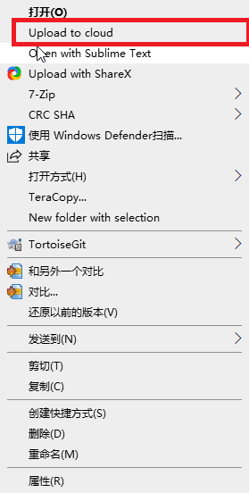

# 四知回--Markdown文件图片自动上传七牛云并更新文件

&#8195;&#8195;

​ 秉承再造一个轮子的一贯特色，重新造了一个自己用的轮子，用于自动将Markdown文件中的图片自动上传到七牛云并自动替换文件中的图片链接。

##   工作流

-  准备文档目录，如sizhihui目录

- 准备文档所需图片，并存放在 sizhihui目录下

- 完成Markdown文件，其中图片部分的写法为本地写法，可以参考下面示例

  ```
  
  ```

- 整个文档完成后，运行工具:

  

-  工具会自动将Markdown中引用的图片上传到七牛云并且自动更新Markdown文件为:

   > qiniu_原来文件名_日期_秒.md

- 直接copy新生成的文件的内容，粘贴到相应blog和网站的markdown编辑器中即可哦

------

##   工具使用方法

### 下载使用

- 


